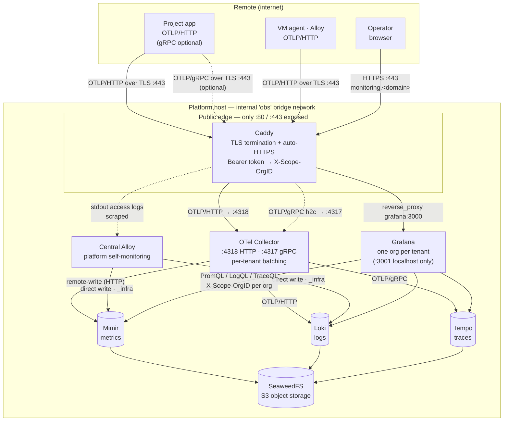

# Architecture

The path telemetry takes through the stack, the protocol on every hop, and
why each component was chosen.

## Principle

> Tenant identity is the project. It is established by a credential at the
> edge, and it is never something the client gets to claim.

Every signal carries one tenant id — the `X-Scope-OrgID` header — stamped by
the edge after it authenticates the project's token. A client cannot send
data as another project because it never chooses its own tenant. See
[identity-model.md](identity-model.md) for the full identity scheme.

## Data flow

Ingest is HTTP end-to-end; the only gRPC in the default path is the internal
collector → Tempo leg.

How to read it:

- **Solid** = the default path; **dotted** = optional (client gRPC) or the
  self-monitoring side channel.
- **Caddy is the only public door.** `:80/:443` face the internet; the
  collector, backends, and S3 have no host ports; Grafana's `:3001` is
  localhost-only, reached publicly via Caddy's `monitoring.<domain>` vhost.
  The port model (`EDGE_BIND` / `SERVICE_BIND`) is documented in
  `.env.example`.
- **Two agent routes.** Remote VM agents go through the authenticated edge;
  the central Alloy writes directly to Mimir/Loki (the `_infra` tenant) since
  it is already inside the trust boundary.
- **Tenant isolation rides one header the whole way.** Caddy stamps
  `X-Scope-OrgID` from the token → the collector preserves it
  (`headers_setter`) → the backends store under it → Grafana's per-org
  datasources query with it.

## Protocol per hop

| Hop | Protocol | Notes |
|---|---|---|
| app / agent → Caddy `:443` | OTLP/HTTP over TLS | gRPC also accepted (rides 443, matched by `Content-Type: application/grpc`) |
| Caddy → collector `:4318` | OTLP/HTTP | Caddy forwards the same protocol the client used — it never transcodes |
| Caddy → collector `:4317` | OTLP/gRPC (h2c) | only for clients that chose gRPC |
| collector → Mimir | Prometheus remote-write (HTTP) | metrics |
| collector → Loki | OTLP/HTTP | logs |
| collector → Tempo | OTLP/gRPC | traces — the one internal gRPC hop |
| Mimir / Loki / Tempo → SeaweedFS | S3 | swappable for AWS S3 / R2 / B2 via `.env` |
| Grafana → backends | PromQL / LogQL / TraceQL | `X-Scope-OrgID` pinned per org datasource |

## The collector pipeline

The gateway collector does the per-tenant heavy lifting between the edge and
the backends: `memory_limiter` (OOM guard), per-tenant batching
(`metadata_keys: [X-Scope-OrgID]`), retry on failure, and fan-out to the
three backends with the tenant header preserved.

## Why each component

| Concern | Choice | Why |
|---|---|---|
| Edge / auth / TLS | Caddy | Automatic HTTPS (no cert toil), declarative token→tenant `map`, easy to template per tenant |
| Pipeline | OTel Collector (contrib) | Vendor-neutral; per-tenant batching, retry, redaction/sampling hooks |
| Metrics | Mimir | Multi-tenant via `X-Scope-OrgID` — the same mechanism as Loki/Tempo, so tenancy is uniform across all three signals (VictoriaMetrics is lighter but scopes by URL path, breaking the uniform model) |
| Logs | Loki | LGTM-native multi-tenant logs on object storage |
| Traces | Tempo | Multi-tenant traces on object storage; metrics-generator provides RED metrics for free |
| Storage | SeaweedFS (S3) | Apache-2.0, actively maintained, S3-compatible (MinIO's OSS edition was archived in early 2026). All storage settings are env-driven, so moving to AWS S3 / R2 / B2 is a `.env` change |
| Read isolation | Grafana organizations | The only real read boundary in Grafana OSS; one org per project, datasources pinned to the tenant header |
| Onboarding | `tenants.yaml` + renderer | Adding a project is one entry + `make render`; no hand-editing of six configs |

## How isolation works, end to end

1. **Write path** — Caddy authenticates the token and stamps
   `X-Scope-OrgID: <tenant>`. The collector forwards it unchanged; the
   backends run with multitenancy enabled, so tenants are physically
   separated in storage.
2. **Read path** — each project gets a Grafana org whose datasources are
   pinned (`httpHeaderName1: X-Scope-OrgID`). A user in project-alpha's org
   cannot construct a query against project-beta's data: the only datasources
   they can reach carry alpha's header. (Corollary: project users must never
   hold org Admin — see the security section in the [README](../README.md).)
3. **Lifecycle** — retention and rate/series limits are per-tenant via each
   backend's runtime overrides, so projects get independent retention and a
   noisy one can't starve the rest.

## What this platform automates on top of Grafana OSS

Multi-org Grafana OSS is workable but under-tooled: several gaps that
Enterprise papers over are instead closed here by the renderer,
`bootstrap-orgs`, and the group model.

| Grafana OSS gap | How this platform closes it |
|---|---|
| File provisioning reaches only org 1 — other orgs never see dashboard or datasource files | `bootstrap-orgs` imports dashboards and datasources into every project org via the API; `make reload` chains it, so orgs can't drift from git |
| Provisioning hard-fails naming an org that doesn't exist, but orgs can only be created at runtime | Orgs are created post-boot via the API and resolved by name, so the bootstrap order always works and id drift is harmless |
| No datasource-level RBAC — any user of a shared org could query any tenant | One org per project, with datasources pinned to the tenant's `X-Scope-OrgID`; the org itself is the read boundary |
| An org Admin can create datasources, i.e. point one at another tenant's header | The Editor-max invariant for project users, audited automatically on every `bootstrap-orgs` run (`SECURITY` warning names offenders) |
| Org ids are assigned sequentially per instance — not portable, not stable | `tenants.lock.yaml` allocates deterministic per-tenant ids with tombstones; binding is by name, so the number is only a local label |
| No cross-org sharing — a shared VM's infra would be visible to only one project | The group model: read-only `_infra-<group>` datasources are injected into every member org |
| Alerting is silent out of the box (default contact point is an email receiver with no SMTP) | Provisioned contact points, per-group dead-man rules generated by `make render`, and SMTP passed through from `.env` |

## Known limits (single box, OSS)

1. **Single-node object storage is a shared failure domain.** Mitigate with
   replicated SeaweedFS plus offsite backups, or point `.env` at AWS S3 /
   R2 / B2 to offload durability. Revisit Kubernetes + distributed storage
   when the deployment outgrows one box.
2. **The remaining Grafana Enterprise gaps** can't be closed from outside:
   SSO with automatic org mapping, RBAC *inside* an org, and per-user
   label-based data filtering. The table above covers everything else;
   self-serve SSO is where OSS stops being enough.
3. **Noisy neighbors** — per-tenant ingest/query limits are mandatory, not
   optional.

These are deliberate trade-offs for "Compose, medium scale", not oversights.

See [instrumenting-apps.md](instrumenting-apps.md) for what to send in.
