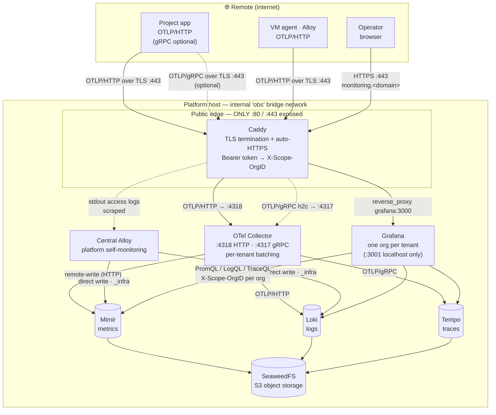

# Architecture — data flow

The complete path telemetry takes through the stack, with the exact protocol on
every hop. Ingest is **HTTP end-to-end**; the only gRPC in the default path is
the internal collector → Tempo leg for traces.

## How to read it

- **Solid** = the default/live path; **dotted** = optional (client gRPC) or the
  self-monitoring side-channel.
- **Caddy is the only public door** — `:80/:443` face the internet; the
  collector, backends, and S3 have **no host ports**; Grafana's `:3001` is
  localhost-only (reached publicly via Caddy's `monitoring.<domain>` vhost). See
  the port model (`EDGE_BIND` / `SERVICE_BIND`) in `.env.example`.
- **Two agent routes:** remote VM agents go *through* the authenticated edge; the
  central Alloy writes *directly* to Mimir/Loki (the `_infra` tenant), since it's
  already inside the trust boundary.
- **Tenant isolation rides one header the whole way:** Caddy stamps
  `X-Scope-OrgID` from the project token → the collector preserves it
  (`headers_setter`) → the backends store under it → Grafana's per-org
  datasources query with it. A project can neither write as, nor read, another's
  data.

## Protocol per hop

| Hop | Protocol | Notes |
|---|---|---|
| app / agent → Caddy `:443` | OTLP/**HTTP** over TLS | gRPC also accepted (rides 443, matched by `Content-Type: application/grpc`) |
| Caddy → collector `:4318` | OTLP/**HTTP** | Caddy forwards the *same* protocol the client used — it never transcodes |
| Caddy → collector `:4317` | OTLP/**gRPC** (h2c) | only for clients that chose gRPC |
| collector → **Mimir** | Prometheus **remote-write** (HTTP) | metrics |
| collector → **Loki** | OTLP/**HTTP** | logs |
| collector → **Tempo** | OTLP/**gRPC** | traces — the one internal gRPC hop |
| Mimir / Loki / Tempo → **SeaweedFS** | S3 | swappable for AWS S3 / R2 / B2 |
| Grafana → backends | PromQL / LogQL / TraceQL | `X-Scope-OrgID` pinned per org datasource |

See [REDESIGN.md](../REDESIGN.md) for the design rationale, and
[instrumenting-apps.md](instrumenting-apps.md) for what to send in.
